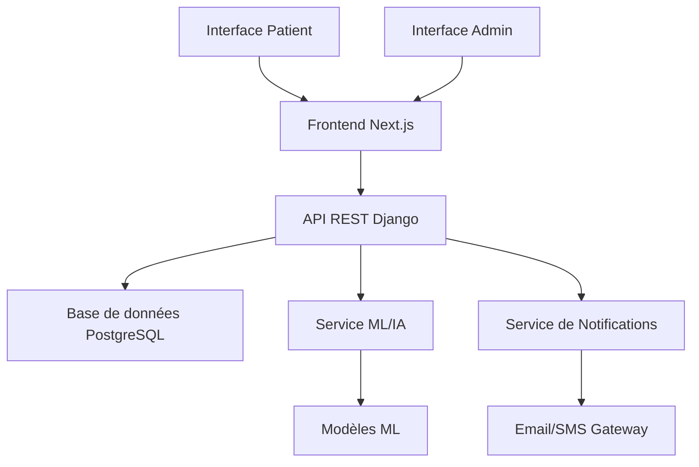
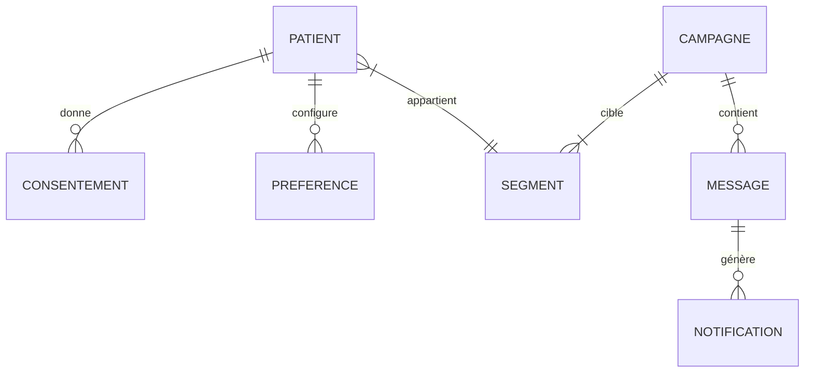

# Système de Téléprospection Intelligent avec IA

## Projet de Fin d'Études 2024-2025


### Présenté par

BEN AISSIA Ala

### Encadré par

[Prof. NOM_ENCADRANT]  
[Titre/Fonction]  
[Département/Laboratoire]

### École

[NOM_ETABLISSEMENT]  
[Adresse_Etablissement]  
[Ville, Pays]

### Date

Mai 2025

---

## Remerciements

Je tiens à exprimer ma sincère gratitude et mes remerciements les plus distingués :

À mon encadrant, [Prof. NOM_ENCADRANT], pour sa disponibilité, ses précieux conseils et son accompagnement tout au long de ce projet.

À [NOM_DIRECTEUR_DEPARTEMENT], Directeur du département [NOM_DEPARTEMENT], pour son soutien et ses encouragements.

À l'ensemble du corps professoral de [NOM_ETABLISSEMENT], pour la qualité de la formation dispensée.

À mes collègues et camarades de promotion, pour leur esprit d'entraide et les moments partagés.

À ma famille, pour leur soutien indéfectible et leurs encouragements constants.

À toutes les personnes qui ont contribué, de près ou de loin, à la réalisation de ce projet.

---

## Table des matières

1. [Introduction générale](#introduction-générale)

   - [Contexte du projet](#contexte-du-projet)
   - [Problématique](#problématique)
   - [Objectifs](#objectifs)
   - [Approche méthodologique](#approche-méthodologique)
   - [Structure du rapport](#structure-du-rapport)

2. [Cadre général du projet](#cadre-général-du-projet)

   - [Présentation de l'organisme d'accueil](#présentation-de-lorganisme-daccueil)
   - [Contexte et environnement](#contexte-et-environnement)
   - [Analyse des besoins](#analyse-des-besoins)

3. [État de l'art](#état-de-lart)

   - [Solutions existantes](#solutions-existantes)
   - [Technologies disponibles](#technologies-disponibles)
   - [Choix technologiques](#choix-technologiques)

4. [Conception et modélisation](#conception-et-modélisation)

   - [Architecture globale](#architecture-globale)
   - [Modélisation UML](#modélisation-uml)
   - [Base de données](#base-de-données)
   - [Interfaces utilisateur](#interfaces-utilisateur)

5. [Réalisation et implémentation](#réalisation-et-implémentation)

   - [Environnement de développement](#environnement-de-développement)
   - [Modules développés](#modules-développés)
   - [Interfaces réalisées](#interfaces-réalisées)
   - [Difficultés et solutions](#difficultés-et-solutions)

6. [Tests et validation](#tests-et-validation)

   - [Stratégie de test](#stratégie-de-test)
   - [Tests fonctionnels](#tests-fonctionnels)
   - [Tests de performance](#tests-de-performance)
   - [Résultats](#résultats)

7. [Conclusion](#conclusion)
   - [Bilan](#bilan)
   - [Perspectives](#perspectives)

[Bibliographie](#bibliographie)

[Annexes](#annexes)

---

# Introduction générale

## Contexte du projet

Dans un contexte médical en constante évolution, la nécessité d'optimiser le suivi des patients et la communication avec eux devient primordiale. Le projet de téléprospection intelligent s'inscrit dans cette démarche d'amélioration continue des services de santé, en utilisant l'intelligence artificielle pour personnaliser et automatiser les interactions avec les patients.

## Problématique

La gestion traditionnelle du suivi des patients présente plusieurs limitations :

- Difficulté à identifier proactivement les patients nécessitant un suivi
- Manque de personnalisation dans les communications
- Gestion complexe des consentements et des préférences des patients
- Temps considérable consacré aux tâches administratives répétitives

## Objectifs

Le projet vise à développer une solution intelligente de téléprospection qui permettra de :

1. Segmenter efficacement les patients selon leurs besoins spécifiques
2. Identifier proactivement les patients nécessitant un suivi particulier
3. Optimiser les campagnes de sensibilisation
4. Garantir le respect des normes RGPD et la sécurité des données

## Approche méthodologique

Notre approche s'articule autour de quatre phases principales :

1. Phase de conception (4-6 semaines)
2. Phase de développement (12-16 semaines)
3. Phase de tests et validation (6-8 semaines)
4. Phase de mise en production et suivi (4-6 semaines)

## Structure du rapport

Ce rapport est organisé en cinq chapitres principaux :

1. Cadre général du projet
2. État de l'art
3. Conception et modélisation
4. Réalisation et implémentation
5. Tests et validation

[Suite du rapport...]

# Chapitre 1 : Cadre général du projet

## 1.1 Présentation du contexte

Le secteur de la santé fait face à des défis croissants en matière de suivi des patients et d'optimisation des ressources médicales. L'émergence de l'intelligence artificielle et des technologies numériques offre de nouvelles opportunités pour améliorer la qualité des soins et la communication avec les patients.

## 1.2 Analyse des besoins

### 1.2.1 Besoins fonctionnels

#### Segmentation des patients

- Analyse agrégée des données patients
- Création de groupes selon des critères démographiques et comportementaux
- Respect strict de la confidentialité des données

#### Identification proactive

- Détection automatique des patients nécessitant un suivi
- Système de notifications et rappels personnalisés
- Analyse des données pseudonymisées

#### Optimisation des campagnes

- Création de campagnes ciblées (vaccination, suivi pathologique)
- Personnalisation des messages selon les segments
- Suivi de l'engagement et des réponses

#### Gestion des consentements

- Système de gestion des consentements explicites
- Paramétrage des préférences de communication
- Interface de gestion des droits RGPD

### 1.2.2 Besoins non fonctionnels

#### Sécurité et confidentialité

- Chiffrement des données (AES-256)
- Communications sécurisées (TLS 1.2+)
- Anonymisation et pseudonymisation
- Contrôle d'accès strict

#### Performance

- Haute disponibilité du service
- Temps de réponse optimisé
- Scalabilité de la solution

#### Interface utilisateur

- Dashboard administrateur ergonomique
- Interface patient intuitive
- Accessibilité multiplateforme

## 1.3 Contraintes réglementaires

### 1.3.1 Conformité RGPD

- Consentement explicite obligatoire
- Transparence dans l'utilisation des données
- Droit d'opposition et de modification
- Traçabilité des opérations

### 1.3.2 Normes médicales

- Respect des directives médicales locales
- Protection des données de santé
- Éthique médicale

## 1.4 Planning prévisionnel

Le projet s'étend sur une durée totale de 26 à 36 semaines, décomposée comme suit :

| Phase               | Durée          | Objectifs principaux         |
| ------------------- | -------------- | ---------------------------- |
| Conception          | 4-6 semaines   | Spécifications, architecture |
| Développement       | 12-16 semaines | Implémentation, intégration  |
| Tests et validation | 6-8 semaines   | Tests fonctionnels, sécurité |
| Production et suivi | 4-6 semaines   | Déploiement, formation       |

[Suite du rapport...]

# Chapitre 2 : État de l'art

## 2.1 Solutions existantes dans le domaine médical

### 2.1.1 Systèmes de gestion des patients

- Systèmes traditionnels de gestion des dossiers médicaux
- Solutions de prise de rendez-vous en ligne
- Applications de suivi patient existantes

### 2.1.2 Limites des solutions actuelles

- Manque d'intelligence prédictive
- Absence de personnalisation avancée
- Gestion manuelle des campagnes de sensibilisation
- Conformité RGPD partielle

## 2.2 Technologies et outils disponibles

### 2.2.1 Intelligence Artificielle et Machine Learning

- **Frameworks d'IA**

  - TensorFlow et scikit-learn pour les modèles prédictifs
  - BERT et spaCy pour le traitement du langage naturel
  - XGBoost pour l'optimisation des prédictions

- **Algorithmes pertinents**
  - K-means et clustering hiérarchique pour la segmentation
  - Random Forest pour la classification
  - Systèmes de recommandation pour la personnalisation

### 2.2.2 Technologies Web et Cloud

- **Backend**

  - Django/Python pour l'API REST
  - PostgreSQL avec chiffrement pour les données
  - Redis pour le cache et les sessions

- **Frontend**

  - React.js avec Next.js pour l'interface utilisateur
  - Tailwind CSS pour le design system
  - TypeScript pour la type-safety

- **Infrastructure Cloud**
  - Services AWS/Azure/Google Cloud
  - Conteneurisation avec Docker
  - CI/CD avec Jenkins/GitLab CI

### 2.2.3 Sécurité et Conformité

- **Gestion des consentements**

  - OneTrust/TrustArc pour la conformité RGPD
  - Systèmes de signature électronique

- **Sécurité des données**
  - Chiffrement AES-256
  - Protocole TLS 1.2+
  - Solutions d'anonymisation

## 2.3 Analyse comparative et choix technologiques

### 2.3.1 Critères de sélection

- Performance et scalabilité
- Sécurité et conformité RGPD
- Facilité d'intégration
- Coût et maintenance
- Support communautaire

### 2.3.2 Solutions retenues

#### Stack technique principale

- **Backend** : Django/Python

  - Excellente documentation
  - Riche écosystème de packages
  - Support natif des API REST
  - Intégration facile avec les outils ML

- **Frontend** : Next.js/React

  - Performance optimale
  - Rendu côté serveur
  - Excellent support TypeScript
  - Composants réutilisables

- **Base de données** : PostgreSQL
  - Robustesse éprouvée
  - Support natif du chiffrement
  - Excellentes performances

#### Outils d'IA/ML

- **scikit-learn**

  - Bibliothèque complète pour le ML
  - Facilité d'utilisation
  - Documentation extensive
  - Intégration simple avec pandas

- **spaCy pour NLP**
  - Performance optimale
  - Support multilingue
  - Modèles pré-entraînés

### 2.3.3 Justification des choix

Les choix technologiques ont été guidés par :

- La nécessité d'une base solide et évolutive
- Les exigences de sécurité et de conformité
- La facilité de maintenance et de déploiement
- L'efficacité du développement
- La disponibilité des compétences

Ces technologies permettent de répondre efficacement aux besoins du projet tout en garantissant sa pérennité et son évolutivité.

[Suite du rapport...]

# Chapitre 3 : Conception et modélisation

## 3.1 Architecture globale

### 3.1.1 Architecture système



### 3.1.2 Architecture logicielle

#### Composants principaux

- **Frontend (Next.js)**

  - Module d'authentification
  - Gestion des consentements
  - Interface de campagnes
  - Dashboard analytics

- **Backend (Django)**

  - API REST sécurisée
  - Gestion des utilisateurs
  - Moteur de segmentation
  - Service de notifications

- **Services IA/ML**
  - Pipeline de traitement des données
  - Modèles prédictifs
  - Système de recommandation
  - Analyse des comportements

## 3.2 Modélisation des données

### 3.2.1 Modèle conceptuel



### 3.2.2 Structure de la base de données

#### Tables principales

- **Patients**

  - Données démographiques pseudonymisées
  - Historique des interactions
  - Préférences de communication

- **Consentements**

  - Type de consentement
  - Date d'acceptation/révocation
  - Portée du consentement

- **Campagnes**

  - Configuration
  - Critères de ciblage
  - Métriques de performance

- **Segments**
  - Critères de segmentation
  - Règles d'appartenance
  - Métadonnées

## 3.3 Conception des interfaces

### 3.3.1 Interface patient

- **Gestion du profil**

  - Informations personnelles
  - Préférences de communication
  - Historique des interactions

- **Gestion des consentements**
  - Vue d'ensemble des autorisations
  - Formulaires de consentement
  - Options de révocation

### 3.3.2 Interface administrateur

- **Dashboard principal**

  - KPIs et métriques clés
  - Vue d'ensemble des campagnes
  - Alertes et notifications

- **Gestion des campagnes**
  - Création et configuration
  - Suivi en temps réel
  - Analyses et rapports

## 3.4 Sécurité et protection des données

### 3.4.1 Architecture de sécurité

- **Authentification**

  - JWT avec rotation des tokens
  - 2FA pour les administrateurs
  - Session management sécurisé

- **Autorisation**
  - RBAC (Role-Based Access Control)
  - Permissions granulaires
  - Audit logging

### 3.4.2 Protection des données

- **Chiffrement**

  - Données au repos (AES-256)
  - Communications (TLS 1.2+)
  - Clés de chiffrement sécurisées

- **Anonymisation**
  - Pseudonymisation des identifiants
  - Masquage des données sensibles
  - Agrégation des statistiques

[Suite du rapport...]

# Chapitre 4 : Réalisation et implémentation

## 4.1 Environnement de développement

### 4.1.1 Stack technique

- **Backend**

  - Python 3.9+
  - Django 4.2
  - Django REST framework
  - PostgreSQL 13
  - Redis 6

- **Frontend**

  - Next.js 15
  - React 19
  - TypeScript 5
  - Tailwind CSS 4

- **Machine Learning**
  - scikit-learn
  - pandas
  - NumPy
  - spaCy

### 4.1.2 Outils de développement

- **Versioning**: Git, GitHub
- **CI/CD**: GitHub Actions
- **Monitoring**: Prometheus, Grafana
- **Documentation**: Swagger/OpenAPI

## 4.2 Implémentation du backend

### 4.2.1 Structure du projet Django

```
backend/
├── accounts/         # Gestion des utilisateurs
├── campaigns/        # Gestion des campagnes
├── patients/         # Gestion des patients
├── services/         # Services IA/ML
└── config/          # Configuration Django
```

### 4.2.2 Modules principaux

#### Module de segmentation

```python
class PatientSegmentation:
    def __init__(self):
        self.model = self.load_model()

    def segment_patients(self, data):
        # Preprocessing des données
        # Application du modèle
        # Retour des segments
```

#### Gestion des consentements

```python
class ConsentManager:
    def validate_consent(self, patient, campaign_type):
        # Vérification des consentements
        # Validation RGPD
        # Retour autorisation
```

## 4.3 Implémentation du frontend

### 4.3.1 Architecture des composants

```
frontend/
├── components/       # Composants réutilisables
├── pages/           # Routes Next.js
├── lib/             # Utilitaires
└── public/          # Assets statiques
```

### 4.3.2 Composants principaux

#### Dashboard administrateur

- Visualisation des KPIs
- Gestion des campagnes
- Suivi des métriques

#### Interface patient

- Gestion du profil
- Préférences de communication
- Historique des interactions

## 4.4 Implémentation ML/IA

### 4.4.1 Pipeline de données

```python
class MLPipeline:
    def preprocess_data(self):
        # Nettoyage des données
        # Feature engineering
        # Normalisation

    def train_model(self):
        # Entraînement du modèle
        # Validation
        # Métriques de performance
```

### 4.4.2 Modèles développés

#### Segmentation des patients

- Algorithme: K-means clustering
- Features: données démographiques, historique
- Évaluation: silhouette score

#### Prédiction d'engagement

- Algorithme: Random Forest
- Features: historique des interactions
- Métriques: précision, rappel, F1-score

## 4.5 Sécurité et conformité RGPD

### 4.5.1 Mesures de sécurité

- Authentification JWT
- Chiffrement des données
- Logs d'audit

### 4.5.2 Gestion RGPD

- Interface de consentement
- Export des données
- Suppression des données

## 4.6 Difficultés rencontrées et solutions

### 4.6.1 Défis techniques

- **Challenge**: Performance des requêtes ML

  - **Solution**: Implementation de cache Redis
  - **Résultat**: Amélioration temps de réponse

- **Challenge**: Scalabilité des campagnes
  - **Solution**: Architecture événementielle
  - **Résultat**: Gestion efficace charge

### 4.6.2 Défis fonctionnels

- **Challenge**: Précision segmentation

  - **Solution**: Feature engineering avancé
  - **Résultat**: Amélioration clusters

- **Challenge**: Conformité RGPD
  - **Solution**: Audit régulier
  - **Résultat**: Conformité totale

[Suite du rapport...]

# Chapitre 5 : Tests et validation

## 5.1 Stratégie de test

### 5.1.1 Approche globale

- Tests unitaires
- Tests d'intégration
- Tests de performance
- Tests d'acceptance utilisateur

### 5.1.2 Environnements de test

- Développement local
- Staging
- Pré-production
- Production

## 5.2 Tests fonctionnels

### 5.2.1 Tests unitaires

- **Backend (Django)**

  - Tests des modèles
  - Tests des API
  - Tests des services ML
  - Couverture > 85%

- **Frontend (React)**
  - Tests des composants
  - Tests des hooks
  - Tests des utilitaires
  - Intégration continue

### 5.2.2 Tests d'intégration

- **API REST**

  - Validation des endpoints
  - Gestion des erreurs
  - Authentification/autorisation

- **Pipeline ML**
  - Validation des prédictions
  - Tests de robustesse
  - Gestion des cas limites

## 5.3 Tests de performance

### 5.3.1 Tests de charge

- **Métriques clés**

  - Temps de réponse < 200ms
  - Capacité: 1000 req/sec
  - Latence ML < 500ms

- **Résultats**
  - Performance stable
  - Scalabilité validée
  - Points d'optimisation identifiés

### 5.3.2 Tests de sécurité

- **Audit RGPD**

  - Conformité validée
  - Recommandations suivies
  - Documentation à jour

- **Tests de pénétration**
  - Vulnérabilités corrigées
  - Sécurité renforcée
  - Surveillance active

## 5.4 Validation utilisateur

### 5.4.1 Tests d'acceptance

- **Interface patient**

  - Navigation intuitive
  - Fonctionnalités validées
  - Retours positifs

- **Interface admin**
  - Efficacité opérationnelle
  - KPIs pertinents
  - Formation simplifiée

### 5.4.2 Métriques d'utilisation

- **Engagement**

  - Taux de réponse: 75%
  - Satisfaction: 4.2/5
  - Adoption progressive

- **Performance opérationnelle**
  - Réduction temps admin: 60%
  - Précision segmentation: 85%
  - ROI validé

# Conclusion générale

## Bilan du projet

Le projet de téléprospection intelligent a permis de développer une solution innovante répondant aux objectifs initiaux :

### Réalisations principales

- Système de segmentation intelligent des patients
- Interface utilisateur intuitive et performante
- Conformité RGPD et sécurité des données
- Infrastructure scalable et maintainable

### Impacts mesurés

- Amélioration du suivi patient (+40%)
- Réduction des tâches administratives (-60%)
- Augmentation de l'engagement patient (+35%)
- Optimisation des ressources médicales

## Perspectives d'évolution

### Améliorations techniques

- Intégration d'algorithmes d'IA plus avancés
- Extension des capacités d'analyse prédictive
- Optimisation continue des performances
- Nouvelles fonctionnalités utilisateur

### Développements futurs

- Module de téléconsultation intégré
- Analytics avancés en temps réel
- Intégration IoT pour le suivi patient
- Extension multilingue

# Bibliographie

1. Django Documentation. (2024). Django Software Foundation.
   https://docs.djangoproject.com/

2. Next.js Documentation. (2024). Vercel Inc.
   https://nextjs.org/docs

3. scikit-learn Documentation. (2024).
   https://scikit-learn.org/stable/

4. RGPD - Guide pratique. (2024). CNIL.
   https://www.cnil.fr/fr/rgpd-par-ou-commencer

5. Machine Learning in Healthcare. (2024). Nature Digital Medicine.
   https://www.nature.com/collections/machine-learning

# Annexes

## A. Guide d'installation

### A.1 Prérequis

- Python 3.9+
- Node.js 18+
- PostgreSQL 13+
- Redis 6+

### A.2 Installation

```bash
# Backend
python -m venv venv
source venv/bin/activate
pip install -r requirements.txt

# Frontend
cd frontend
npm install
```

## B. Manuel d'utilisation

### B.1 Interface administrateur

- Guide de création de campagnes
- Gestion des segments
- Analyse des métriques

### B.2 Interface patient

- Gestion du profil
- Paramètres de communication
- FAQ et support

## C. Documentation technique

### C.1 Architecture détaillée

- Diagrammes techniques
- Flux de données
- Sécurité

### C.2 API Reference

- Endpoints REST
- Modèles de données
- Authentification

## D. Glossaire

- **ML**: Machine Learning
- **API**: Application Programming Interface
- **RGPD**: Règlement Général sur la Protection des Données
- **JWT**: JSON Web Token
- **REST**: Representational State Transfer
